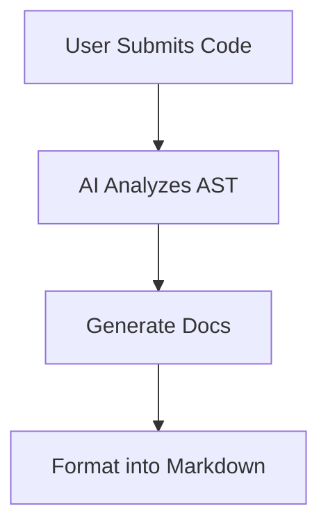

# Platform Features

The HGM-06 Smart Documentation System is packed with powerful tools to streamline developer workflows.

## AI Search Agent
The embedded AI search agent processes queries natively against the entire indexed MD documentation repository, delivering real-time LLM-driven answers with verified citations.

## Automatic Sidebar Generation
Headers inside your Markdown (`#`, `##`) are dynamically parsed to populate dynamic intra-page navigation trees automatically.

## AI Code Documentation
The platform intelligently analyzes raw software code and generates:
- Docstrings (Google, NumPy, JSDoc)
- API Ref Tables
- Mermaid Flowcharts
- Code Quality Scores

